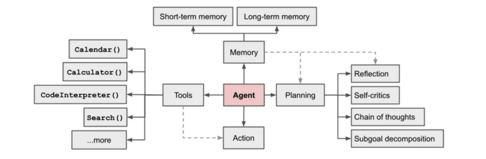

# 从AI Agent到OpenClaw

> OpenClaw 不是“更强的 Agent”，而是“Agent 的操作系统”

本章将围绕这一演进路径展开，从 AI Agent 的基本范式出发，分析其在复杂场景中的局限，并逐步引出任务系统、记忆架构与多 Agent 协作机制，最终落脚于一个更完整的系统形态：**OpenClaw**。

## 什么是AI Agent

AI Agent热潮，准确来说，从2023年3月开始。

那时候，一个叫AutoGPT框架项目发布，项目利用大型语言模型，能自动把一个大任务拆分成小任务，并使用工具完成它们。

::: callout-note
AutoGPT 框架 是一个开源的自主 AI 智能体（Autonomous AI Agent）系统

> 它的核心理念是：你只需给出一个目标（Goal），AI 就能自动拆解任务、规划步骤、调用工具、执行操作，并根据结果自我修正，直到完成任务，全程无需人类逐步指令
:::

"Agent"一词虽然早在*马文·明斯基*、*Russell* 和 *Norvig* 等知名学者的著作中出现，"Agent"，中文意思是代理人。代理人，你可以理解成有人帮你去做某件事。但在大模型时代，OpenAI 重新定义了这一概念。AI agent是什么？简单来说，一个由AI技术加持的代理人，它变得更聪明了，可以感知周围的环境，并且能够独立地思考和行动。 Lilian Weng 在其个人博客中对 Agent 的主要功能进行了详细描述，提供了一个更为精确的定义。她指出，狭义上的 `Agent` 具备技能调用、记忆和规划能力。

{fig-align="center" fig-alt="AI Agent"}

**广义的Agent**：在狭义的Agent基础上进行扩展，具有基础智能、角色管理、节能调用、复杂思维以及未来五感集成能力

## Agent核心能力

## 从 Agent 到“Agent 系统”的关键跃迁

## 记忆系统的系统化

## 工具系统的演进（Tool → Capability）

## openclaw的诞生背景

## 行业生态与竞争格局分析
